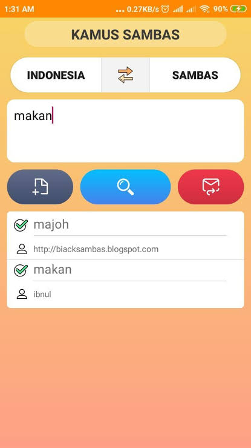
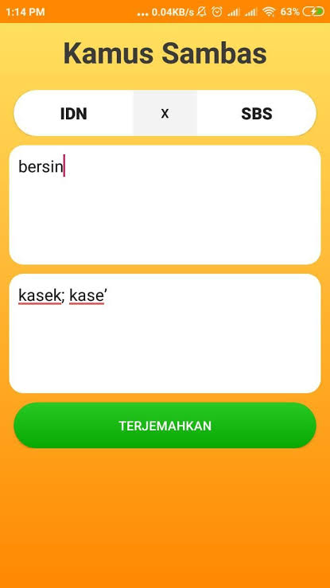
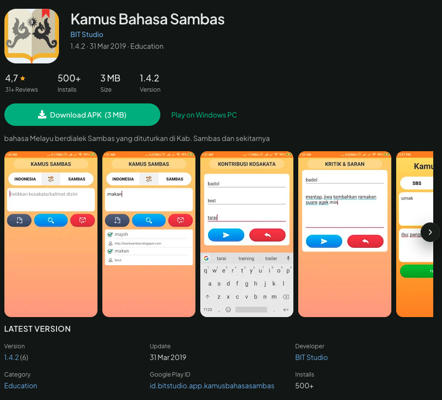

# SambasKu

Rumah bagi penutur, perantau, dan pecinta bahasa Melayu Sambas.

[sambasku.com](https://sambasku.com) · [mail@sambasku.com](mailto:mail@sambasku.com)

**SambasKu** adalah proyek komunitas yang didirikan oleh **[Ibnul Mutaki](https://github.com/iamutaki) (`iamutaki`)**, dengan tujuan mendokumentasikan, melestarikan, dan memperkenalkan bahasa serta pengetahuan lokal Sambas.

SambasKu dikembangkan secara terbuka dan melibatkan kontribusi komunitas dalam pengumpulan serta pengembangan konten.

| | |
|---|---|
| **Founder & Initiator** | [Ibnul Mutaki](https://github.com/iamutaki) (`iamutaki`) |
| **Project** | Community-driven |
| **Established** | 2019 |
| **Website** | [sambasku.com](https://sambasku.com) |
| **Source Code** | [GitHub](https://github.com/iamutaki/sambasku) |
| **Contributions** | Open to community |

## Tentang SambasKu

Bahasa Melayu Sambas masih dipakai sehari-hari, tapi kata-katanya sulit ditemukan di internet dan suaranya jarang terdengar.

SambasKu hadir supaya kata-kata Sambas punya tempat di internet, dalam bentuk kamus yang bisa diperbaiki, dilengkapi, dan dijaga bersama.

SambasKu adalah proyek komunitas sukarela, bukan badan hukum, yayasan, atau lembaga resmi. Pengelolanya relawan, dan tidak ada layanan berbayar. Kontributor aktif bisa menerima uang terima kasih. Besarnya tergantung pertimbangan pengelola dan sisa dana kas. Pajak atas uang tersebut menjadi tanggung jawab masing-masing penerima. Semua uang yang masuk dan keluar dicatat dan bisa dilihat siapa saja di [Kas Publik](#kas-publik) karena SambasKu bertujuan untuk merawat dan melestarikan bahasa Melayu Sambas, bukan untuk mencari keuntungan.

SambasKu bisa dibuka di [sambasku.com](https://sambasku.com) atau unduh aplikasinya di [Google Play](https://play.google.com/store/apps/details?id=com.iamutaki.sambasku).

### Sejarah

SambasKu berawal pada tahun 2019 melalui sebuah aplikasi bernama Kamus Bahasa Sambas. Aplikasi tersebut menjadi cikal bakal pengembangan SambasKu hingga kemudian berkembang menjadi proyek komunitas dengan nama SambasKu.

Perkembangannya sempat terhenti karena berbagai hal, hingga akhirnya proyek ini dihidupkan kembali pada tahun 2026 dengan wujud baru: SambasKu.

  
  
  

Jejak aplikasi tersebut masih bisa dilihat di:

- [Kamus Bahasa Sambas di APKCombo](https://apkcombo.com/id/kamus-bahasa-sambas/id.bitstudio.app.kamusbahasasambas/)
- [Kamus Bahasa Sambas di APKPure](https://apkpure.com/id/kamus-bahasa-sambas/id.bitstudio.app.kamusbahasasambas)
- [Postingan berbagi di Facebook Bahase Sambas](https://www.facebook.com/bahasesambas/posts/pfbid02mr2jQbyxvLHTeaC4dFa12yKAeweZiKFjYaNeonGAtqA7J4fMjnxNBcNxrA79gwkcl)
- [Arsip kode aplikasi versi awal](https://github.com/sambasku/mobile-v1) di GitHub (public archive)

## Fitur

Di situs dan aplikasi SambasKu, pengguna bisa:

**Mencari kata dua arah:** dari bahasa Melayu Sambas ke Indonesia, atau sebaliknya. Arti, jenis kata, dan contoh kalimat langsung terlihat, plus rekaman suara kalau tersedia.

**Menyimpan dan mengusulkan kata:** Kata bisa disimpan untuk dibaca lagi nanti. Kata yang belum lengkap atau belum ada bisa diusulkan. Setiap usulan diperiksa lebih dulu sebelum ditampilkan, supaya isi kamus tetap akurat.

**Berinteraksi dan berbagi:** Pengguna bisa memberi penilaian pada kata, menulis komentar, dan berdiskusi. Setiap kontributor punya halaman profil, bisa menyebut (mention) pengguna lain di komentar, menerima notifikasi, dan membagikan kartu kata ke teman atau keluarga.

## Arah Pengembangan

Ke depan, SambasKu tidak hanya menjadi tempat mencari arti kata. Kami ingin cerita di balik kata-kata itu juga tercatat di sini: adat yang masih dijalankan, tokoh yang mengingat sejarah, tempat yang layak dikunjungi, makanan khas, kegiatan warga, profil usaha lokal, hingga bahan belajar untuk anak sekolah.

Kami membangunnya bertahap. Kamus diperkuat lebih dulu sebagai fondasi, baru bagian lain ditambahkan. Setiap bagian baru harus berkaitan langsung dengan bahasa dan budaya Sambas.

SambasKu bukan situs berita daerah dan bukan toko online. Profil usaha lokal hanya berisi informasi, bukan iklan dan bukan tempat transaksi. Fokus kami tetap satu: bahasa Melayu Sambas, beserta kehidupan orang-orang yang menuturkannya.

## Sponsor dan Kerja Sama

Mencari dan membaca kamus SambasKu gratis. Siapa saja boleh ikut merawat bahasa ini: menambah kata, merekam cara pengucapan, menulis contoh kalimat, atau menyusun tulisan budaya yang bisa dibaca semua orang secara gratis.

Dukungan dana hanya dipakai untuk kebutuhan SambasKu, yaitu biaya operasional (domain dan server), honor untuk kontributor, dan pembuatan konten. Semua pemakaiannya dicatat di [Kas Publik](#kas-publik). SambasKu berkomitmen:

- **tidak menjual data pengguna** (lihat [Kebijakan Privasi](../PRIVACY.md)),
- **tidak memasang iklan**, dan
- **tidak dikomersialkan**: tidak ada fitur berbayar, dan konten tidak dijual.

Selain dana, dukungan juga bisa berupa kerja sama konten. Pihak yang biasanya cocok:

- Yayasan, lembaga bahasa, atau perusahaan yang peduli pada literasi dan budaya setempat.
- Pemerintah daerah yang ingin berbagi kosakata, informasi wisata, atau bahan ajar lewat SambasKu.
- Sekolah dan sanggar budaya yang butuh bahan belajar dari kamus yang sudah diperiksa.
- Usaha lokal yang ingin ikut mendukung pelestarian bahasa Sambas.

Pencantuman nama adalah bentuk terima kasih, bukan slot yang dijual. Mitra tidak perlu membayar untuk dicantumkan, termasuk usaha lokal.

### Ketentuan untuk Sponsor dan Mitra

**Sifat kerja sama.** Dukungan bersifat sukarela. Kerja sama ini bukan jual-beli jasa, bukan pemasangan iklan, dan tidak memberi imbalan komersial. Kalau dibutuhkan, rincian kerja sama (misalnya bentuk dan lama waktunya) dibuat kesepakatan tertulis terpisah lewat email atau surat.

**Lisensi konten.** Setiap kontributor merilis kontribusinya di kamus SambasKu, seperti kata, contoh kalimat, dan rekaman suara, di bawah lisensi [CC BY-SA 4.0](https://creativecommons.org/licenses/by-sa/4.0/deed.id). Artinya, siapa saja boleh memakai dan mengolahnya selama mencantumkan sumber dan membagikan hasilnya dengan lisensi yang sama. Konten yang disumbangkan mitra ke kamus juga mengikuti lisensi ini. Mitra tidak mendapat hak eksklusif atau kepemilikan atas konten. Kontributor menjamin konten yang mereka usulkan bukan salinan dari sumber yang melarang penggunaan ulang, dan kami periksa ulang sebelum tayang.

**Yang didapat mitra.** Hanya pencantuman nama sebagai pendukung. Dukungan tidak memberi pengaruh apa pun atas isi kamus dan konten SambasKu. Untuk mitra di bidang kesehatan, yang dicantumkan hanya nama dan logo, tanpa klaim khasiat, testimoni, atau promosi layanan.

**Seleksi.** Nama dan logo tidak otomatis dipasang. Setiap dukungan kami tinjau dulu, dan nama serta logo hanya dicantumkan kalau memenuhi semua kriteria berikut:

- Tidak terlibat kegiatan yang melanggar hukum Indonesia.
- Tidak merugikan pengguna SambasKu, baik langsung maupun tidak langsung.
- Sejalan dengan nilai SambasKu: pendidikan, bahasa, dan budaya.
- Khusus usaha dan lembaga: bersedia menunjukkan bukti legalitas, seperti NIB, akta pendirian, atau izin operasional (untuk layanan kesehatan), kalau kami minta.

Kami tidak mencantumkan dukungan dari pihak yang terkait dengan:

- perjudian dalam bentuk apa pun;
- pinjaman online yang tidak berizin OJK;
- pornografi atau konten dewasa;
- obat, suplemen, kosmetik, atau produk kesehatan tanpa izin edar BPOM;
- layanan kesehatan tanpa izin yang berlaku, seperti klinik, apotek, praktik tenaga kesehatan, atau pengobat tradisional yang tidak terdaftar (pemiliknya hanya bisa mendukung sebagai sponsor perorangan, lihat ketentuan di bawah);
- penyalahgunaan data pribadi.

**Nama dan logo SambasKu.** Kemitraan bukan bentuk dukungan (endorsement) SambasKu terhadap produk atau layanan mitra. Mitra tidak boleh memakai nama atau logo SambasKu di materi mereka tanpa izin tertulis dari kami.

**Usaha kesehatan yang belum terdaftar.** Usaha pengobatan, termasuk pengobatan tradisional, yang belum punya izin atau surat terdaftar dari dinas kesehatan tidak dicantumkan sebagai mitra, walaupun layanannya sudah lama dipercaya warga. Pemiliknya tetap boleh mendukung sebagai sponsor perorangan. Yang dicantumkan hanya nama pribadinya, tanpa nama usaha, logo, atau keterangan layanan.

**Sponsor perorangan.** Nama sponsor perorangan hanya dicantumkan setelah yang bersangkutan setuju.

**Tautan.** Tautan sponsor dan mitra kami periksa sebelum dipasang. Tautan yang mengarah ke virus, penipuan online (malware, phishing), atau konten yang melanggar kriteria di atas tidak akan dipasang, atau dicabut kalau sudah terpasang.

**Pencabutan.** Kami berhak menolak atau mencabut pencantuman nama dan logo kapan saja, dan akan memberitahukan yang bersangkutan, termasuk kalau sponsor atau mitra tidak lagi memenuhi kriteria di atas. Nama dan logo sponsor serta mitra dicantumkan dengan persetujuan tertulis yang bersangkutan.

### Tempat Nama dan Logo Ditampilkan

Nama dan logo sponsor dan mitra yang lolos seleksi hanya ditampilkan di:

- halaman Tentang dan halaman Mitra di SambasKu;
- laporan berkala, misalnya jumlah kata baru, rekaman suara, atau tulisan budaya yang berhasil didanai.

**Tanpa iklan:** Nama dan logo mitra tidak muncul saat orang mencari kata, membaca arti kata, atau membuka aplikasi. Jadi SambasKu tidak akan terasa seperti papan iklan.

**Bukan tempat jualan:** SambasKu tidak menjual arti kata, barang, atau jasa, dan tidak menjadi tempat transaksi. Nama mitra dicantumkan sebagai pendukung, bukan sebagai iklan.

Bantuan bisa dipakai untuk merekam cara pengucapan dari penutur asli bahasa Sambas, menambah contoh kalimat, membiayai situs dan aplikasi supaya tetap bisa diakses, atau menyusun bahan belajar untuk sekolah dan tulisan tentang budaya.

### Menjadi Sponsor

Dukungan bisa diberikan lewat [GitHub Sponsors](https://github.com/sponsors/sambasku) atau [Saweria](https://saweria.co/sambasku), atau [hubungi kami](mailto:mail@sambasku.com) untuk bentuk kerja sama lain.

Dana diterima atas nama pribadi oleh Ibnul Mutaki selaku pengelola/relawan SambasKu, lalu dicatat di [Kas Publik](#kas-publik). Dukungan ini adalah pemberian sukarela tanpa imbalan untuk mendukung proyek, bukan donasi amal, sumbangan sosial, atau pembayaran atas barang dan jasa.

Kalau mendukung lewat GitHub Sponsors, nama pendukung bisa tampil di halaman GitHub Sponsors kami, sesuai pengaturan privasi di GitHub.

Ingin bekerja sama atas nama sekolah, kantor dinas, yayasan, atau perusahaan? Untuk perkenalan awal, tidak perlu menyiapkan proposal atau surat resmi. Cukup kirim email singkat ke [mail@sambasku.com](mailto:mail@sambasku.com) yang berisi:

- nama pribadi, nama instansi, dan asal daerahnya;
- alasan instansi ingin mendukung SambasKu;
- bentuk dukungan yang ingin diberikan, misalnya dana, tenaga, atau materi belajar.

Email yang masuk akan kami baca dan balas. Kalau kerja samanya berlanjut, dokumen resmi bisa disiapkan belakangan sesuai kebutuhan kedua belah pihak.

### Sponsor Saat Ini

- **Galang Septiadi** - Pembelian domain sambasku.com (tahun 2026)

### Mitra Saat Ini

- Belum ada.

Kamu juga bisa ikut mendukung SambasKu lewat [GitHub Sponsors](https://github.com/sponsors/sambasku) atau [Saweria](https://saweria.co/sambasku).

## Kas Publik

Karena SambasKu bukan badan hukum, kas SambasKu dipegang dan dikelola secara pribadi oleh Ibnul Mutaki selaku pengelola relawan. Seluruh catatannya terbuka dan bisa diperiksa siapa saja. Kalau proyek ini berhenti, sisa kas dipakai lebih dulu untuk memperpanjang domain dan menyimpan konten, lalu kas ditutup. Sisa kas yang belum terpakai disumbangkan untuk kegiatan serupa yang merawat bahasa daerah, bukan untuk kepentingan pribadi pengelola.

Catatan kas dibagi dua, supaya tagihan yang belum jatuh tempo tidak tercampur dengan uang yang sudah masuk atau keluar:

- [cashflow.csv](../cashflow.csv) untuk uang yang sudah masuk atau keluar. Debit berarti uang masuk, kredit berarti uang keluar, dan saldo adalah sisa kas.
- [payable.csv](../payable.csv) untuk tagihan yang pasti dibayar walau belum jatuh tempo. Periode: `tahunan`, `bulanan`, atau `sekali`.

Tagihan saat ini:

- Domain [sambasku.com](https://sambasku.com), perpanjangan tahunan: **10,46 USD**, jatuh tempo 24 Agustus 2027 (domain aktif sampai 23 September 2027). [Tangkapan harga](../images/domain_sambasku_com_renewal.png)

## Catatan Konten

Konten kamus disusun komunitas dan dilisensikan "sebagaimana adanya" di bawah CC BY-SA 4.0. SambasKu tidak menjamin keakuratan setiap entri untuk keperluan hukum atau akademik formal.

## Komunitas

Punya pertanyaan, ingin berdiskusi, atau sekadar menyapa sesama pecinta bahasa Sambas? Yuk, gabung bersama kami! Grup komunitas dijaga moderator dan mengikuti [Kode Etik](../KODE-ETIK.md) kami.

Dokumen resmi layanan: [Syarat dan Ketentuan](https://sambasku.com/id/syarat-ketentuan) dan [Kebijakan Privasi](https://sambasku.com/id/privacy-policy) di sambaskan.com.

