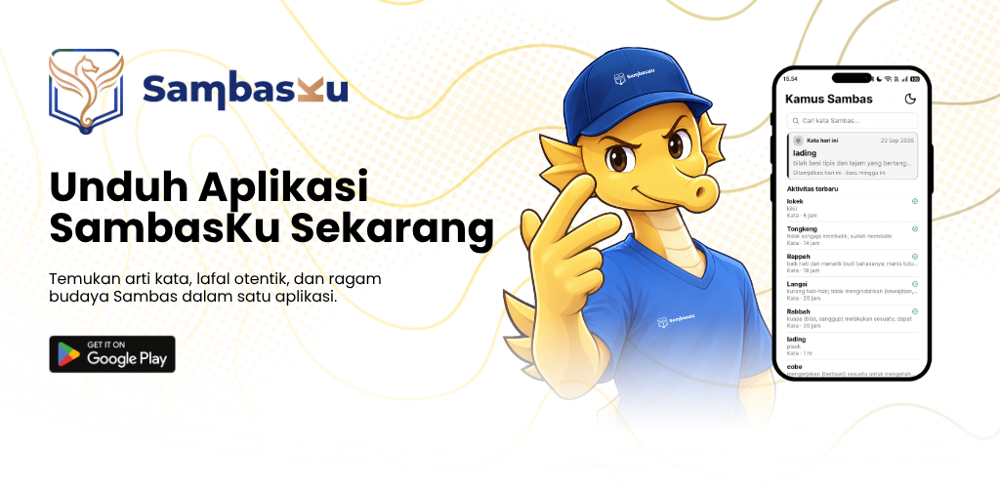

# SambasKu

Rumah bagi penutur, perantau, dan pecinta bahasa Melayu Sambas.

[sambasku.com](https://sambasku.com) · [mail@sambasku.com](mailto:mail@sambasku.com)

## Tentang SambasKu

Bahasa Melayu Sambas masih dituturkan sehari-hari, di rumah maupun di pasar. Namun di internet, kata-katanya sulit ditemukan dan cara pengucapannya jarang bisa didengar.

SambasKu hadir supaya kata-kata Sambas punya tempat di internet, dalam bentuk kamus yang bisa diperbaiki, dilengkapi, dan dijaga bersama.

SambasKu adalah proyek komunitas yang dijalankan secara sukarela. SambasKu bukan badan hukum, bukan yayasan, dan bukan lembaga resmi. Pengelolanya relawan yang tidak digaji, dan tidak ada layanan berbayar. Kontributor tertentu, misalnya perekam suara, bisa menerima honorarium kecil sebagai pengganti waktu dan tenaga. Semua pengeluaran dicatat terbuka di [Kas Publik](#kas-publik). Tujuan SambasKu adalah merawat bahasa Melayu Sambas, bukan mencari keuntungan.

Saat ini kami fokus memperkuat kamus supaya isinya bisa dipercaya. Kamu bisa membukanya di [sambasku.com](https://sambasku.com) atau mengunduh aplikasinya di [Google Play](https://play.google.com/store/apps/details?id=com.iamutaki.sambasku). Tampilan aplikasinya berbahasa Indonesia.

## Fitur

Di situs dan aplikasi SambasKu, kamu bisa:

**Mencari kata dua arah:** dari bahasa Melayu Sambas ke bahasa Indonesia, atau sebaliknya. Arti, jenis kata, dan contoh kalimat langsung terlihat. Kalau rekamannya tersedia, kamu juga bisa mendengar cara pengucapannya.

**Menyimpan dan mengusulkan kata:** Simpan kata yang ingin kamu baca lagi nanti. Kalau ada kata yang belum lengkap atau belum ada, kamu bisa mengusulkannya. Setiap usulan diperiksa lebih dulu sebelum ditampilkan, supaya isi kamus tetap akurat.

**Berinteraksi dan berbagi:** Kamu bisa memberi penilaian pada kata, menulis komentar, dan berdiskusi. Setiap kontributor punya halaman profil. Kamu juga bisa menyebut (mention) pengguna lain di komentar, menerima notifikasi, dan membagikan kartu kata ke teman atau keluarga.

## Arah Pengembangan

Ke depan, SambasKu tidak hanya menjadi tempat mencari arti kata. Kami ingin cerita di balik kata-kata itu juga tercatat di sini: adat yang masih dijalankan, tokoh yang mengingat sejarah, tempat yang layak dikunjungi, makanan khas, kegiatan warga, profil usaha lokal, hingga bahan belajar untuk anak sekolah.

Kami membangunnya bertahap. Kamus diperkuat lebih dulu sebagai fondasi, baru bagian lain ditambahkan. Setiap bagian baru harus berkaitan langsung dengan bahasa dan budaya Sambas.

SambasKu bukan situs berita daerah dan bukan toko online. Profil usaha lokal hanya berisi informasi, bukan iklan dan bukan tempat transaksi. Fokus kami tetap satu: bahasa Melayu Sambas, beserta kehidupan orang-orang yang menuturkannya.

## Sponsor dan Kerja Sama

Mencari dan membaca kamus SambasKu gratis. Siapa saja boleh ikut merawat bahasa ini: menambah kata, merekam cara pengucapan, menulis contoh kalimat, atau menyusun tulisan budaya yang bisa dibaca semua orang secara gratis.

Dukungan dana hanya dipakai untuk kebutuhan SambasKu, yaitu biaya operasional (domain dan server), honorarium kecil untuk kontributor, dan pembuatan konten. Semua pemakaiannya dicatat di [Kas Publik](#kas-publik). SambasKu berkomitmen:

- **tidak menjual data pengguna**,
- **tidak memasang iklan**, dan
- **tidak dikomersialkan**: tidak ada fitur berbayar, dan konten tidak dijual.

Selain dana, dukungan juga bisa berupa kerja sama konten. Pihak yang biasanya cocok:

- Yayasan, lembaga bahasa, atau perusahaan yang peduli pada literasi dan budaya setempat.
- Pemerintah daerah yang ingin berbagi kosakata, informasi wisata, atau bahan ajar lewat SambasKu.
- Sekolah dan sanggar budaya yang butuh bahan belajar dari kamus yang sudah diperiksa.
- Usaha lokal yang ingin ikut mendukung pelestarian bahasa Sambas.

Pencantuman nama adalah bentuk terima kasih, bukan slot yang dijual. Mitra tidak perlu membayar untuk dicantumkan, termasuk usaha lokal.

### Ketentuan untuk Sponsor dan Mitra

**Sifat kerja sama.** Dukungan bersifat sukarela. Kerja sama ini bukan jual-beli jasa, bukan pemasangan iklan, dan tidak memberi imbalan komersial. Kalau dibutuhkan, rincian kerja sama (misalnya bentuk dan lama waktunya) dituangkan dalam kesepakatan tertulis terpisah lewat email atau surat.

**Lisensi konten.** Konten kamus yang disusun komunitas SambasKu, seperti kata, contoh kalimat, dan rekaman suara, dirilis dengan lisensi [CC BY-SA 4.0](https://creativecommons.org/licenses/by-sa/4.0/deed.id). Artinya, siapa saja boleh memakai dan mengolahnya selama mencantumkan sumber dan membagikan hasilnya dengan lisensi yang sama. Konten yang disumbangkan mitra ke kamus juga mengikuti lisensi ini. Mitra tidak mendapat hak eksklusif atau kepemilikan atas konten.

**Yang didapat mitra.** Hanya pencantuman nama sebagai pendukung. Dukungan tidak memberi pengaruh apa pun atas isi kamus dan konten SambasKu.

**Seleksi.** Nama dan logo tidak otomatis dipasang. Setiap dukungan kami tinjau dulu, dan nama serta logo hanya dicantumkan kalau memenuhi semua kriteria berikut:

- Tidak terlibat kegiatan yang melanggar hukum Indonesia.
- Tidak merugikan pengguna SambasKu, baik langsung maupun tidak langsung.
- Sejalan dengan nilai SambasKu: pendidikan, bahasa, dan budaya.
- Khusus usaha dan lembaga: bersedia menunjukkan bukti legalitas, seperti NIB atau akta pendirian, kalau kami minta.

Kami tidak mencantumkan dukungan dari pihak yang terkait dengan:

- perjudian dalam bentuk apa pun;
- pinjaman online yang tidak berizin OJK;
- pornografi atau konten dewasa;
- obat, suplemen, atau produk kesehatan tanpa izin edar BPOM;
- penyalahgunaan data pribadi.

**Nama dan logo SambasKu.** Kemitraan bukan bentuk dukungan (endorsement) SambasKu terhadap produk atau layanan mitra. Mitra tidak boleh memakai nama atau logo SambasKu di materi mereka tanpa izin tertulis dari kami.

**Sponsor perorangan.** Nama sponsor perorangan hanya dicantumkan setelah yang bersangkutan setuju.

**Tautan.** Tautan sponsor dan mitra kami periksa sebelum dipasang. Tautan yang mengarah ke malware, phishing, atau konten yang melanggar kriteria di atas tidak akan dipasang, atau dicabut kalau sudah terpasang.

**Pencabutan.** Kami berhak menolak atau mencabut pencantuman nama dan logo kapan saja, termasuk kalau sponsor atau mitra tidak lagi memenuhi kriteria di atas.

### Tempat Nama dan Logo Ditampilkan

Nama dan logo sponsor dan mitra yang lolos seleksi hanya ditampilkan di:

- halaman Tentang dan halaman Mitra di SambasKu;
- laporan berkala, misalnya jumlah kata baru, rekaman suara, atau tulisan budaya yang berhasil didanai.

**Tanpa iklan:** Nama dan logo mitra tidak muncul saat orang mencari kata, membaca arti kata, atau membuka aplikasi. Jadi SambasKu tidak akan terasa seperti papan iklan.

**Bukan tempat jualan:** SambasKu tidak menjual arti kata, barang, atau jasa, dan tidak menjadi tempat transaksi. Nama mitra dicantumkan sebagai pendukung, bukan sebagai iklan.

Bantuanmu bisa dipakai untuk merekam cara pengucapan dari penutur asli bahasa Sambas, menambah contoh kalimat, membiayai situs dan aplikasi supaya tetap bisa diakses, atau menyusun bahan belajar untuk sekolah dan tulisan tentang budaya.

### Menjadi Sponsor

Kamu bisa mendukung lewat [GitHub Sponsors](https://github.com/sponsors/sambasku) atau [Saweria](https://saweria.co/sambasku), atau menghubungi kami untuk bentuk kerja sama dalam bentuk lainnya.

Dana diterima atas nama pribadi oleh Ibnul Mutaki selaku pengelola/relawan SambasKu, lalu dicatat di [Kas Publik](#kas-publik). Dukungan ini adalah pemberian sukarela untuk proyek, bukan donasi amal atau sumbangan sosial, dan tidak memberi imbalan barang atau jasa.

Kalau kamu mendukung lewat GitHub Sponsors, namamu bisa tampil di halaman GitHub Sponsors kami, sesuai pengaturan privasi yang kamu pilih di GitHub.

Ingin bekerja sama atas nama sekolah, kantor dinas, yayasan, atau perusahaan? Untuk perkenalan awal, kamu tidak perlu menyiapkan proposal atau surat resmi. Cukup kirim email singkat ke [mail@sambasku.com](mailto:mail@sambasku.com) yang berisi:

- nama kamu, nama instansi, dan asal daerahnya;
- alasan instansimu ingin mendukung SambasKu;
- bentuk dukungan yang ingin diberikan, misalnya dana, tenaga, atau materi belajar.

Kami akan membaca dan membalas emailmu. Kalau kerja samanya berlanjut, dokumen resmi bisa disiapkan belakangan sesuai kebutuhan kedua belah pihak.

### Sponsor Saat Ini

- **Galang Septiadi** - Pembelian domain sambasku.com (tahun 2026)

### Mitra Saat Ini

- Belum ada.

Kamu juga bisa menjadi pendukung berikutnya lewat [GitHub Sponsors](https://github.com/sponsors/sambasku) atau [Saweria](https://saweria.co/sambasku).

## Kas Publik

Karena SambasKu bukan badan hukum, kas SambasKu dipegang dan dikelola secara pribadi oleh Ibnul Mutaki selaku pengelola relawan. Seluruh catatannya terbuka dan bisa diperiksa siapa saja. Kalau proyek ini berhenti, sisa kas dipakai lebih dulu untuk memperpanjang domain dan mengarsipkan konten, lalu kas ditutup.

Catatan kas dibagi dua, supaya tagihan yang belum jatuh tempo tidak tercampur dengan uang yang sudah masuk atau keluar:

- [cashflow.csv](../cashflow.csv) untuk uang yang sudah masuk atau keluar. Debit berarti uang masuk, kredit berarti uang keluar, dan saldo adalah sisa kas.
- [payable.csv](../payable.csv) untuk tagihan yang pasti dibayar walau belum jatuh tempo. Periode: `tahunan`, `bulanan`, atau `sekali`.

Tagihan saat ini:

- Domain [sambasku.com](https://sambasku.com), perpanjangan tahunan: **10,46 USD**, jatuh tempo 24 Agustus 2027 (domain aktif sampai 23 September 2027). [Tangkapan harga](../images/domain_sambasku_com_renewal.png)

## Komunitas

Punya pertanyaan, ingin berdiskusi, atau sekadar menyapa sesama pecinta bahasa Sambas? Yuk, gabung bersama kami!

