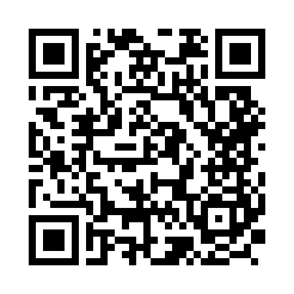

  

<h1 align="center">SambasKu</h1>

  Kami adalah pengembang kamus digital bahasa Melayu Sambas dan bahasa Indonesia.

  <a href="https://sambasku.com">sambasku.com</a>

## Tentang

Kami membangun SambasKu bersama penutur bahasa Melayu Sambas, supaya kosakata daerah ini terdokumentasi, mudah dicari, dan tetap dipelajari.

Yang kami kembangkan adalah kamus itu sendiri: situs [sambasku.com](https://sambasku.com) dan aplikasi Android. Pengunjung mencari dari kata Sambas atau dari bahasa Indonesia, membaca makna, kelas kata, dan contoh kalimat, lalu memutar pelafalan pada entri yang memilikinya. Kata bisa disimpan, dan usulan kata baru diperiksa sebelum tayang.

Antarmuka aplikasi berbahasa Indonesia.

## Gabung komunitas

Gabung komunitas untuk berkenalan dengan pengguna lain, meminta bantuan, dan mengikuti perkembangan terbaru. Ada server Discord [bacot.io](https://discord.gg/2cs7Hn9Uht) dan grup WhatsApp:

